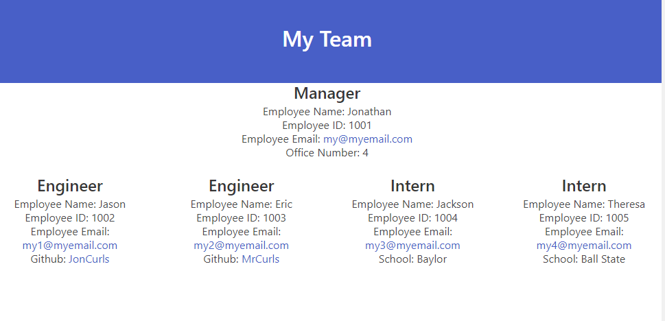

# **Team Profile Generator**

## **Thumbnail**

## **Description**

- An application that collects data from the user about a manager and any number of other employees who are Engineers or Interns. It collects Name, ID, Email, Manager's Office Number, Engineer's Github, and Intern's School.

## **Table of Contents**

- [Installation](#installation)
- [Usage](#usage)
- [License](#license)
- [Contributing](#contributing)
- [Testing](#testing)
- [Questions](#questions)

## **Installation**

- DL from github

## **Usage**

- [Watch install video](./assets/demo_team_profilemp4.mp4) or use: node index and then follow with terminal prompts.

## **License**

- Unlicense

## **Contributing**

- Open source baby

## **Testing**

- Jest to [test](./assets/testing.mp4)

## **Questions**

Made with ❤️💧🩸

- www.github.com/JonCurls
- JonCurls@gmail.com
